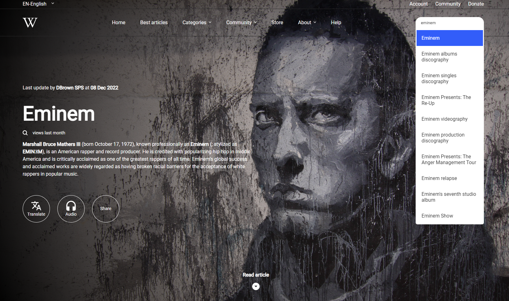
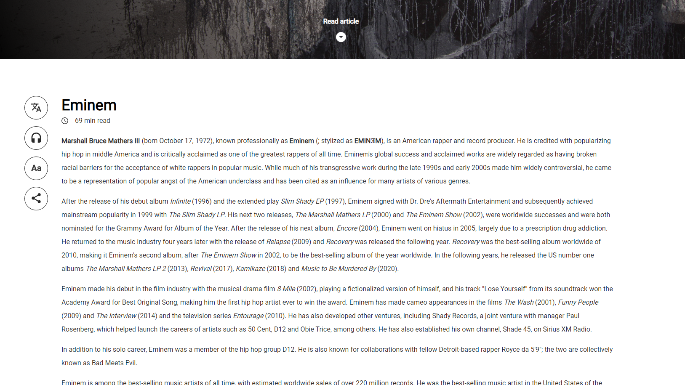
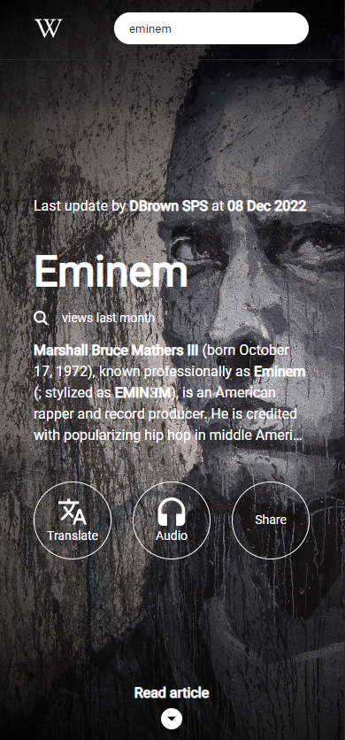

# Technical Documentation

Wikipedia is an online encyclopedia maintained by a model of open collaboration. They provide free access to their data through the MediaWiki API. I used this project to communicate with and exhibit data from this API. I'm not this designs original creator, just used it as a model for this experience.

## Table of contents

- [Overview](#overview)
  - [Screenshots](#screenshots)
  - [Links](#links)
- [My process](#my-process)
  - [Built with](#built-with)
- [Author](#code-author)
- [Reference](#reference)

## Overview

### Screenshots

- Landing page

- First paragraph

- Landing page (Mobile Preview)

### Links

- Solution URL: [https://github.com/victorfbrito/wikipedia-redesign](https://github.com/victorfbrito/wikipedia-redesign)
- Live Site URL: [https://wikipedia-redesign-umber.vercel.app/article/Eminem](https://wikipedia-redesign-umber.vercel.app/article/Eminem)

## My process

### Built with

- Vue
- Styled Components
- MediaWiki API

## Code author

- LinkedIn - [Victor Brito](https://www.linkedin.com/in/vbrito-dev/)
- GitHub - [Victor Brito](https://github.com/victorfbrito/)
- 
## Reference

- Redesign Wikipedia - [https://fine-baker-057.notion.site/English-Redesign-Wikipedia-918709ddcc444c19854bd807b5dac794](https://fine-baker-057.notion.site/English-Redesign-Wikipedia-918709ddcc444c19854bd807b5dac794)
